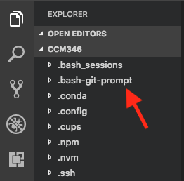

# Setting up your Macintosh, Part 1

Everything listed here is free unless otherwise noted.

## At the beginning of the semester

### Code editor

* Install the code editor [Visual Studio Code](https://code.visualstudio.com/download). There are other good ones ([Atom](https://atom.io/), [Sublime](https://www.sublimetext.com/3)), but I'll use VS Code in class.
* Add the `code` command [to your path](https://code.visualstudio.com/docs/setup/mac).

### Version control system

* Install [Git](https://git-scm.com/downloads), our source code version control program. This will allow us to save our code in steps. Don't worry about the Git GUI clients.
* [Set your username](https://help.github.com/articles/setting-your-username-in-git/) in Git.
* Open a new Terminal window to install the `git-bash-prompt` and do the following:

```bash
git clone https://github.com/magicmonty/bash-git-prompt.git .bash-git-prompt --depth=1
```

* If you were able to set the `code` command above, you should be able to do `code ./` to open VS Code in a new window from your home directory. If that doesn't work, then from VS Code, start a New Window, the Open your home folder on your Mac.
* Look for a file called `.bash_profile`, which might not exist yet. If you have one, open it. If you don't, then use VS Code to create a new file there and call it ".bash_profile". The preceding dot is important.
* Add this to the bottom of the file `.bash_profile` file:

``` text
GIT_PROMPT_ONLY_IN_REPO=1
source ~/.bash-git-prompt/gitprompt.sh
```

Close and restart your terminal to take the new settings. [More on git-bash-prompt if we need it](https://github.com/magicmonty/bash-git-prompt).

### Set up Github

If you don't already have a Github account, go to [github.com/](http://github.com/) and create an account. Two important things to note:

* Choose your username carefully. I wouldn't use upper case characters or special characters because this will become part of a URL later. Don't make the name specific to this class. This is your personal Github profile FOREVER.
* USE YOUR UNIVERSITY EMAIL IF YOU HAVE ONE. You might want to apply for the [Student developer pack](https://help.github.com/articles/applying-for-a-student-developer-pack/), which will get you private repositories.

### Saving your Github credentials

There are ways you can tell your computers to save your Github username/password. If you are using your own machine, I suggest this first one, setting up SSH keys. If that proves difficult, try the second option.

* You can save an encrypted connection from your machine to Github and never have to enter a username/password by following these directions for [SSH keys](https://help.github.com/articles/connecting-to-github-with-ssh/). It is not as scary as it looks, though there is some command-line foo to execute.
* Or, you can reduce the number of times you have to enter your Github name/password by [caching your password](https://help.github.com/articles/caching-your-github-password-in-git/). We'll have to use this method for lab computers.

### Testing Part 1

We need to make sure everything is set correctly before moving on. So here is how to check:

Before doing this, open a new Terminal window:

- Do `cd ~` to make sure you are in your home directory.
- Do `git config user.name` and you should get a response that is your name.
- Do `git config user.email` and you should get back your email address.
- Do `code ./` and it should launch VS Code in your home directory.

In the list of Documents, there should be two things:

1. A folder called `bash-git-promopt`.



2. A file called `.bash_profile` with the bash-git-prompt info:


