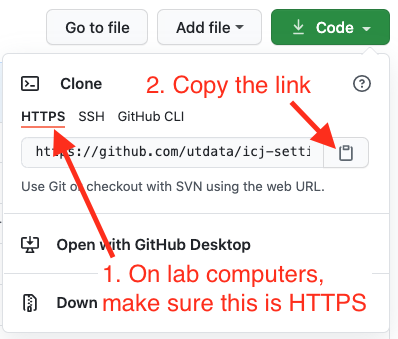

# Starting up a UT Lab computer

> This is for a particular use case in Fall 2020.

Lab machines could get wiped regularly, so you might have to reset everything. You definitely will have to set this up for the first time.

## Test git setups

**Test if it is setup**: Open a new Terminal window and check the git configs:

```bash
git config user.name
```

If it returns your name, great. You can probably stop here.

### If you didn't get your name in the test

If git is not set for you, you need to set it.

- Set your user.name:

```bash
git config --global user.name "Your Name"
```

And then set your email (with your actual email):

```bash
git config --global user.email youremail@yourdomain.com
```

Next, set the computer to save your credentials after the first time you enter them. **Be prepared to enter your github username and password.**

```bash
git config --global credential.helper osxkeychain
```

## Installing node

- First, check if Node is already installed:

```bash
node -v
```

If Node is already installed, you should get back a version number, like "v10.19.0". If it does, you can probably stop here.

### Install NVM, Node, npm

If you didn't get a version number above, you need to install stuff.

- From your Terminal, in your home directory, install NVM:

```bash
curl -o- https://raw.githubusercontent.com/creationix/nvm/v0.33.11/install.sh | bash
```

- **Close and restart** your Terminal window.
- Now install the version of Node we wll use:

```bash
nvm install 10.19.0
```

- Now install node package manager:

```bash
npm install -g npm
```

- Install [Gulp](https://gulpjs.com/) and [Degit](https://www.npmjs.com/package/degit):

```bash
npm install -g gulp degit
```

For good measure restart Terminal and Visual Studio Code.

## To pull an existing project from Github

Let's say you have been working on a project that is stored on Github, but when you come to the lab machine your repo is not on it. Here is how I suggest you get it.

- Launch Terminal
- Go into the Documents folder: `cd Documents`
- Do `ls` just to make sure your project isn't already there. (If it is, stop as you can likely launch VS Code and get to work).
- In your browser, go to your repo on Github.com.
- Click on the green **Code** button.
- Make sure it is on HTTPS and copy the link.



- In your Terminal, do `git clone` and then paste the link and run it.
- This will download AND connect you to the repo.
- Now you can go to Visual Studio Code and open the project folder and work as you normally would. It should be in your `Documents` folder.
- DON'T FORGET TO PUSH YOUR CODE so you don't lose it.

## VS Code goodies

If you want, you can go to [VS Code Goodies](vscode-goodies.md#preferences) and grab the preferences. It might make life easier for you.
