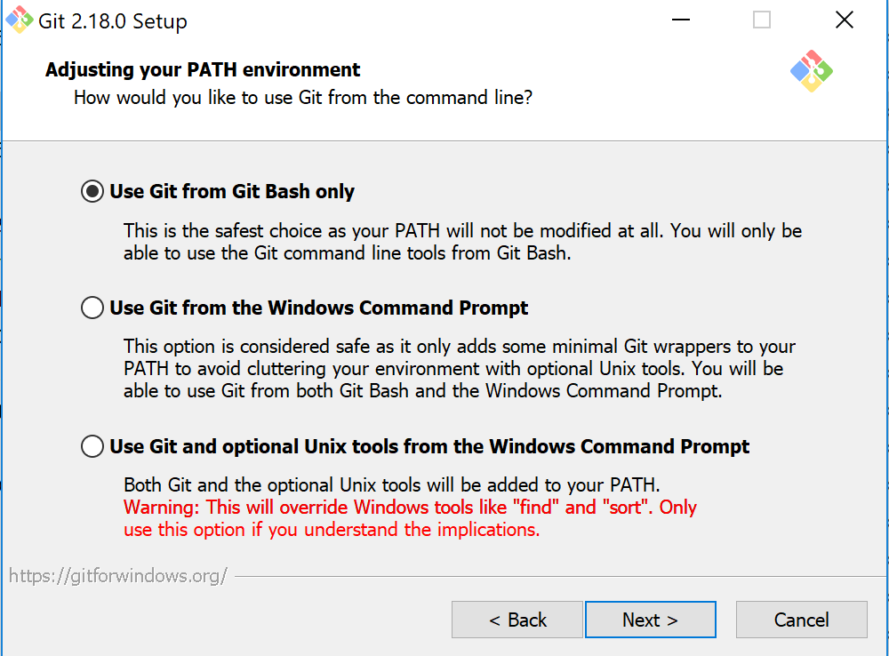
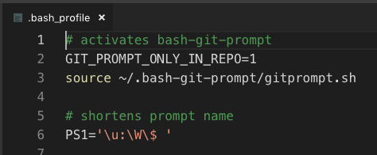

# Windows

We are working through some of the Windows set up, so Windows users may need a little extra care and feeding.

Everything listed here is free unless otherwise noted.

## At the beginning of the semester

### Text editor

- Install [VS Code](https://code.visualstudio.com/docs/setup/windows).
- Once you have installed, use the Command Pallete and select `Select Default Shell` to set your editor as "Git Bash Shell". [Reference](https://code.visualstudio.com/docs/editor/integrated-terminal#_windows). (We _may_ have to set this up after Git is installed?)

### Version control system

- Install [Git](https://git-scm.com/download/win), our source code version control program. This will allow us to save our code in steps. This will also install Git Bash, which will be your terminal app.

There is one point in the installation process where you need to set "Use Git from Git Bash only".



- Configure your [Git profile](https://help.github.com/articles/setting-your-username-in-git/#platform-windows) so you don't have to type you password all the time.
- After setting up Git Bash, you [configure your VS Code integrated terminal](https://code.visualstudio.com/docs/editor/integrated-terminal#_windows). I _think_ the easiest way is to go to View > Command Pallete and type in `Select Default Shell` and find it, but I haven't tried it.

### Set up Github

If you don't already have a Github account, go to [github.com/](http://github.com/) and create an account. Two important things to note:

- Choose your username carefully. Don't use upper case characters or special characters because this will become part of a URL later. Don't make the name specific to this class. This is your personal Github profile FOREVER.
- USE YOUR UNIVERSITY EMAIL IF YOU HAVE ONE. You might want to apply for the [Student developer pack](https://help.github.com/articles/applying-for-a-student-developer-pack/), which will get you private repositories.

### Saving your Github credentials

There are ways you can tell your computers to save your Github username/password. If you are using your own machine, I suggest this first one, setting up SSH keys. If that proves difficult, try the second option.

- I use these directions to create [SSH keys](https://help.github.com/articles/connecting-to-github-with-ssh/) on my machine so I'm never asked for a password. It is not as scary as it looks, though there is some command-line foo to execute.
  - During this process, you'll be asked to save the location of the rsa_id. Just hit return to save the default location.
  - You'll be asked to set a password for the file. Just leave this blank and hit return. It may ask you a couple of time.
  - At the end of the installation, it will give a path to the rsa_id file. We might need to open this file in the next step to copy it. Ask for help at this step.

### Add the SSH key to Github

- Follow [these directions](https://help.github.com/articles/adding-a-new-ssh-key-to-your-github-account/).

### Alternative to SSH keys

If you can't set SSH keys, you can at least reduce the number of times you have to enter your Github name/password by [caching your password](https://help.github.com/articles/caching-your-github-password-in-git/). We'll have to use this method for lab computers.

### Installing bash-git-prompt

- Open a new Git Bash window to install the `git-bash-prompt` and do the following, one line at at time:

```bash
cd ~
git clone https://github.com/magicmonty/bash-git-prompt.git .bash-git-prompt --depth=1
code .bash_profile
```

- This should install the software you need to your home directory, then open (or create) the `.bash_profile` file.
- Add this to the bottom of the file `.bash_profile` file:

``` text
GIT_PROMPT_ONLY_IN_REPO=1
source ~/.bash-git-prompt/gitprompt.sh
```

- Close and restart your terminal to take the new settings.

[More on git-bash-prompt if we need it](https://github.com/magicmonty/bash-git-prompt).

## Testing Part 1

We need to make sure everything is set correctly before moving on. So here is how to check:

Before doing this, open a new Git Bash window:

- Do `cd ~` to make sure you are in your home directory.
- Do `git config user.name` and you should get a response that is your name.
- Do `git config user.email` and you should get back your email address.
- Do `ssh -T git@github.com` to test SSH keys. If you are asked about "RSA key fingerprint", say yes. In the end, you should have a success message like: "Hi username! You've successfully authenticated, but GitHub does not
provide shell access."
- Do `code ./` and it should launch VS Code in your home directory.

In the list of Documents, there should be two things:

1. A folder called `bash-git-promopt`.


2. A file called `.bash_profile` with the bash-git-prompt info:


